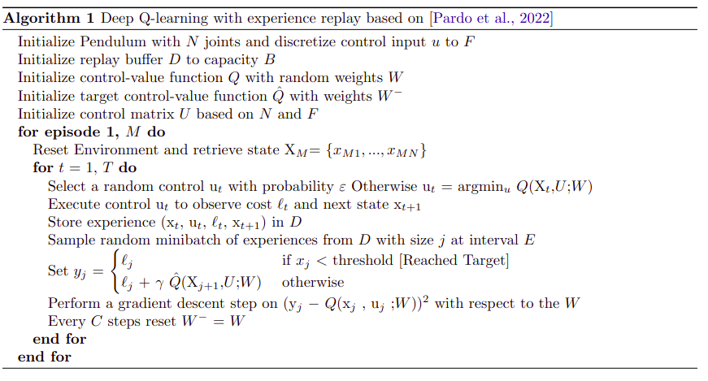

# Introduction

Deep Q-Learning (DQN) fundamentally is Q-Learning with three
distinct important features:

1.  a convolutional neural network for Q-function approximation

2.  use a separate neural network with relatively outdated weights to
    estimate the Q-values of the next state

3.  create mini-batches of random training data rather than single-step
    updates on the last experience. This is to introduce batch learning
    instead of incremental leaning to create more independent data
    points

The pendulum system was generated using Pinocchio \[library for robot
model dynamics\] along with a wrapper to facilitate the dynamics
calculations. The environment had continuous states and discreet
controls. A hybrid environment was created to take the controls and
discretize them to a predefined number. The pendulum’s initial state is
random.

DQN was used to train a network to provide control in the form of
applying torque to the pendulum joints. The algorithm must supply the
correct torque control to the joints to perform a “handstand maneuver"
as Figure [1](#fig:pendulum) shows below.

The neural networks were created using TensorFlow and Keras. The
performance of the algorithm relies on a considerable amount of hyper
parameters, which can be experimented with and optimized to improve the
performance. The training time was quite significant, which limited the
resources to try out and optimize different values for the parameters.

# Methodology

The method used is as shown in the
pseudo-algorithm Figure [2](#fig:algorithm) below. This algorithm is
based on ’s work with slight modification to the terminology. Instead of
maximizing for a reward, we are minimizing for a cost. In addition, we
are equating if the state is equal to zero, within a threshold, as a
trigger for the “Target state Reached". This is to motivate the
algorithm to be as close as possible to target and not want to leave it.

An (ε)  greedy policy was used with an exponential decay.
The probability (ε)  starts at 1, which will promote
extensive exploration at the beginning. The algorithm starts the
exploitation process towards later episodes and acts greedily towards
reducing cost.

The control matrix (U) has the number of joints as its row count and
the discretized number of controls (F). This matrix is used to
generate all the possible combinations of control inputs given the
number of joints.

The replay buffer keeps adding new observations until it reaches its
full capacity. At that time, an old observation gets replaced with a new
one every iteration. A sample is taken from the buffer randomly to use
it in training the Q-value function neural network. This is to create
more independent data points as previously mentioned.

The first neural network is the main Q-value function (Q) that we
are working on minimizing by using Stochastic Gradient Decent (SGD). The
second neural network is the Target Q-value function (Q̂) and
is used as a target for (Q). The weights of (Q) gets updated
frequently every short number of iterations. However, the weights of
(Q̂) remains constant for a much more extended number of
iterations (P) to give time for (Q) to converge. Without this
feature, the algorithm will become unstable because the target we are
trying to reach is constantly moving. The model is stored every number
of iterations because there is a chance that the algorithm may diverge.

The neural network is a Keras model with an input size of the states’
count \[angle and velocity\] plus the joints’ count. For a double
pendulum, it is 4 for the state plus 2 for the joint, with a total of 6
as input size. There are 4 hidden layers with the first having 16,
second with 32, and third and Fourth both with 64 outputs. The output
layer of the model has a size of the joints’ count, which is 2 for a
double pendulum representing the control for each joint.

# Results and Discussion

The target number for episodes per run was 10000. however many obstacles
such as crashes and slow learning caused some runs not to reach that
target. The models were regularly stored (every 100 episodes) because
the performance is not guaranteed to improve.

The early episodes were much faster because the probability
(ε) is very high and randomly selects controls. The
episodes get much slower as(ε)  drops, and the prediction
for greedy control begins. The reason was each (Q) prediction call
took 6 ms to finish. After some research, I found that for small numbers
of inputs that fit in one batch, use (--call--) directly for faster execution. That change dropped it to 800 μs
instead and made the time taken across the episodes much more stable.

Many runs were conducted to test out the effect of the Hyper Parameters
on convergence and target achievement. The parameters tested are shown
in the table below with the better performing values
highlighted in green:

| Hyper Parameter                     | Values Tested                                                |
| :---------------------------------- | :----------------------------------------------------------- |
| Sampling Steps (E)            | 3, 4                       |
| Batch Size (j)                | 32, 64, 128                |
| Episode Length (T)            | 200, 300, 400, 500         |
| Replay Buffer Size (B)        | 20.000, 50.000, 100.000   |
| Update (Q̂) Freq (P) | 100, 500, 1500, 2000, 2500 |

As a test of performance, a number of 100 simulations per 100 episode
output were run for each model to count how many were able to achieve
the task. The task is achieved when the state \[angle and velocity\] are
at minimal threshold, which means the pendulum is at the “Hand Stand"
position. In addition, the pendulum must be able to keep the target
position for at least 50 steps. All of that must occur within 300 steps
total. Table [\[results\]](#results) shows the configuration used, best
percent of success achieved, and at which episode for each run.

| \# | Run configuration                                                           | best average % success | achieved at episode \# |
| :- | :-------------------------------------------------------------------------- | :--------------------- | :--------------------- |
| 1  | (E)= 4, (j)= 64, (T)= 200, (B)=20.000,  (P)=100               | 29.7 %                 | 2000                   |
| 2  | (E)=4, (j)=64,  (T)=300, (B)=20.000, (P)=1500                | 24 %                   | 2200                   |
| 3  | (E)=4, (j)=64,  (T)=300, (B)=100.000, (P)=1500 | 52.5 %                 | 1700                   |
| 4  | (E)=3, (j)=64,  (T)=400, (B)=100.000, (P)=2500 | 57.4 %                 | 1900                   |
| 5  | (E)=4, (j)=64,  (T)=400, (B)=100.000, (P)=2000 | 80.2 %                 | 5300                   |
| 6  | (E)=3, (j)=64,  (T)=500, (B)=100.000, (P)=2500 | 83.2 %                 | 2000                   |

\[results\]

The summary of the results are displayed as a graph in Figure
[3](#fig:res_runs) below. The first and the second runs were omitted
because of low performance overall. It seemed that higher (B),
(T) and (P) \[higher memory buffer, longer steps per episode and
less frequent (Q̂) updating\] yielded better results.
Increasing (B) on it’s own [from run #2 to #3] was
sufficient to get make a major improvement by doubling the performance.
As an overall, the run that achieved the best models was run \#6 at
episodes 1800, 2000 \[w/ 83.2%\] and 2800, 3200 \[w/80.2%\] in a
duplicate run. Run \#5 was a close third at episode 5300 \[w/ 80.2%\].

Given that the high achieving models are quite close in performance, a
secondary test was done to verify a clear winner. The test involved
using each model to simulate 1000 random initial condition trials to
perform the maneuver. The ranking is as follows:

1.  Run \#6 episode 3200 at 88.1 % success rate

2.  Run \#6 episode 1800 at 85.9 % success rate

3.  Run \#6 episode 2000 at 85.0 % success rate

4.  Run \#5 episode 5300 at 75 % success rate

5.  Run \#6 episode 2800 at 74.5 % success rate

While running (B) at 500 and (E) at 3 yielded the best
performer, the model training took double the amount of time compared to
the 400 at 4 models, however it achieved the best results at earlier
episodes \[1800 and 2000 compared to 5300\]. It is reasonable to assume
that longer steps increase the chance of finding episodes where the
pendulum arrives at the target position with minimal velocity. Moreover,
the higher sample frequency (E) appear to have aided in finding
the target with higher success in early stages as well.

The best performances in all the runs regularly occurred earlier in the
episodes \[between 2000 to 5500\]. Running over 6000 episodes showed a
possibility of model over-fitting issues, even though the cost to go
during later runs still keeps decreasing as shown in Figure
[4](#fig:ctg_h).

# Conclusion

The implementation of the deep Q Learning Algorithm presented by  on a
double pendulum was successful. However, there is a major room for
improvement on the time requirement for the learning. While calling the
(-call-) function instead of predict made it six to seven times faster,
performing the gradient decent step is still a big bottle neck. the
latest trial showed that it takes upwards of 3ms per call. This obstacle
prevented the capability of testing more hyper parameters given the
limited time of the project. Later on I was able to slightly improve the
performance by using the (@tf.function) decorator.

Furthermore, there is a great room to improve the Hyper Parameters as
well. While only testing for a couple of combinations, I was able to
increase the success rate from 29% to 80%.

A 3 Joint pendulum training run was tried, however it failed to achieve
the goal state with 0% success across 8800 episodes. Though it could be
possible to test different hyper parameters, especially the step count,
given that it might take a 3 Joint pendulum longer steps to reach
target. In addition, use a higher discount (γ) to favor the
reward further in the future, as it might need more sacrificing of
current reward to get better reward later on.

# Appendix

